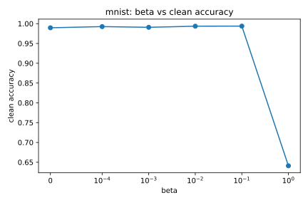
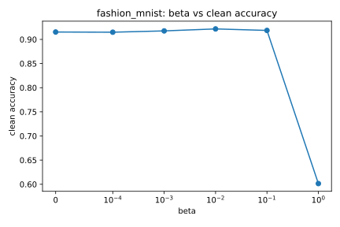
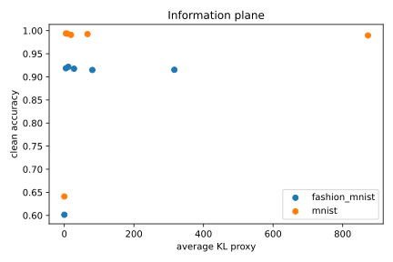
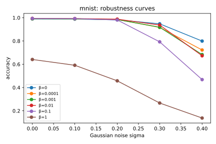
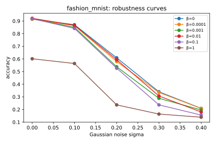
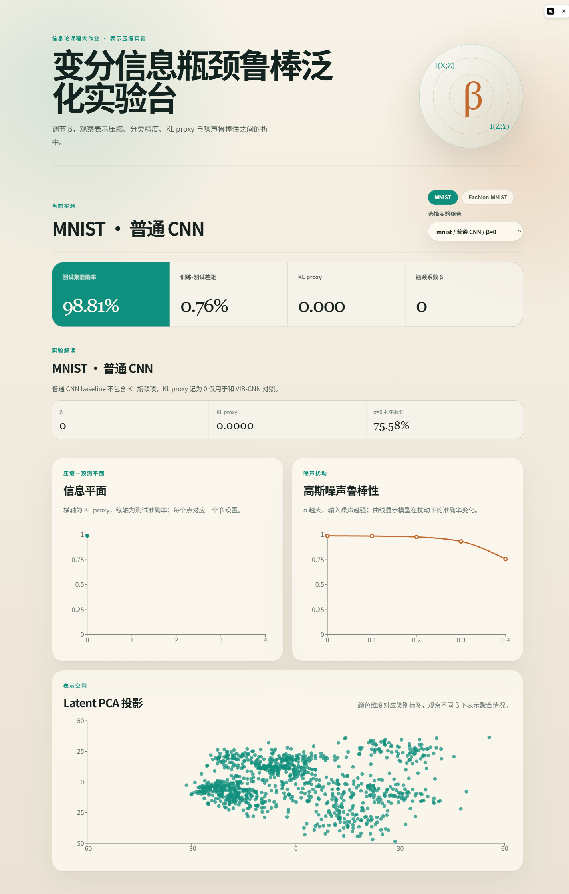

# 基于变分信息瓶颈的神经网络表示压缩与鲁棒泛化分析

## 摘要

本文复现变分信息瓶颈（Variational Information Bottleneck, VIB）在图像分类表示学习中的核心思想，并在 MNIST 与 Fashion-MNIST 上比较普通 CNN 与 VIB-CNN。实验使用 KL(q(z|x)||p(z)) 作为 I(X;Z) 的变分上界 proxy，分析 β 对表示压缩、clean accuracy 和 Gaussian noise 鲁棒性的影响。完整实验包含 2 个数据集、14 个模型配置与 70 个噪声评测点。结果显示，β 能显著控制 KL proxy；适中的 β 在两个数据集上均保持或提升 clean accuracy，但过大的 β 会造成严重欠拟合和任务信息丢失。

## 1 引言

信息论中的压缩与预测之间存在天然张力。深度神经网络的中间表示 Z 可以被理解为输入 X 的编码，同时又要保留足够关于标签 Y 的信息。本文研究的问题是：在图像分类任务中，是否可以通过控制表示压缩强度 β，使模型减少对输入细节或噪声的依赖，从而获得更可解释的鲁棒泛化行为。

## 2 信息论背景

信息瓶颈目标可写为：

```math
\max I(Z;Y) - \beta I(Z;X)
```

其中 I(Z;Y) 表示任务相关信息，I(Z;X) 表示表示中保留的输入信息。VIB 使用变分分布 q_phi(z|x) 和先验 p(z)，将 I(Z;X) 近似为可优化的 KL 上界。本文所有图表中的 KL 均为 KL proxy / variational upper bound，不是精确互信息估计；test accuracy 与 noisy accuracy 也是预测性能和鲁棒性的经验 proxy，不直接等同于 I(Z;Y)。

## 3 方法

普通 CNN 使用卷积编码器得到 latent 表示并直接分类。VIB-CNN 使用相同的卷积骨干，但输出 mu 与 logvar，通过重参数化采样 z，并使用如下目标训练：

```math
\mathcal{L} = CE(\hat{y}, y) + \beta KL(q_\phi(z|x) || p(z))
```

当 β 较小时，模型更接近普通判别式训练，会倾向保留更多输入信息；当 β 增大时，KL 项迫使 q(z|x) 靠近标准正态先验，从而压缩表示。

## 4 实验设置

数据集为 MNIST 与 Fashion-MNIST。每个数据集包含一个 CNN baseline，以及 β ∈ {0, 1e-4, 1e-3, 1e-2, 1e-1, 1} 的 VIB-CNN。鲁棒性测试使用 Gaussian noise，σ ∈ {0.0, 0.1, 0.2, 0.3, 0.4}。所有网页展示、报告表格和图像均来自 `artifacts/full` 的离线实验输出。

## 5 结果与分析

### 5.1 MNIST

MNIST 上，普通 CNN baseline 的 clean accuracy 为 98.81%，train-test gap 为 0.76%。VIB-CNN 在 β=0.1 时取得最高 clean accuracy，为 99.38%，比 CNN baseline 高 0.57 个百分点；此时 KL proxy 为 4.7760，明显低于 β=0 时的 872.7278，说明适度信息瓶颈在保持分类性能的同时显著压缩了表示。

当 β=1 时，MNIST clean accuracy 降至 64.10%，KL proxy 降至 0.0433。这说明过强压缩会将 latent 分布几乎推向先验，虽然 I(X;Z) proxy 很低，但标签相关信息也被大量抹去，导致模型分类能力明显下降。

在 σ=0.4 的噪声测试中，CNN baseline accuracy 为 75.58%。VIB-CNN β=0 的 σ=0.4 accuracy 为 79.92%，是 MNIST 中最高的强噪声结果；β=0.01 的 clean accuracy 很高，但 σ=0.4 accuracy 为 67.30%。这表明 clean accuracy 与强噪声鲁棒性并不完全一致，β 的选择体现了压缩、判别性能与噪声敏感性的多目标折中。



### 5.2 Fashion-MNIST

Fashion-MNIST 上，普通 CNN baseline 的 clean accuracy 为 90.50%，train-test gap 为 2.82%。VIB-CNN 在 β=0.01 时取得最高 clean accuracy，为 92.17%，比 CNN baseline 高 1.67 个百分点；此时 KL proxy 为 11.5234，相比 β=0 的 316.1828 已经大幅下降。该结果说明，在更复杂的服饰分类任务中，适度 VIB 压缩同样能改善 clean generalization。

当 β=1 时，Fashion-MNIST clean accuracy 降至 60.14%，KL proxy 降至 0.0210。与 MNIST 类似，这一配置体现了过压缩现象：模型几乎不再保留足够输入信息，导致分类性能显著退化。

在 σ=0.4 的噪声测试中，CNN baseline accuracy 为 28.81%，高于所有 VIB 配置；VIB-CNN β=0.0001、β=0 和 β=0.001 分别为 20.82%、20.88% 和 19.63%。这说明本实验设置下的 VIB 并未自动带来 Fashion-MNIST 强高斯噪声鲁棒性提升，尤其在输入扰动较大时，压缩带来的表示约束可能不足以抵消图像细节破坏。



### 5.3 信息平面

`report/figures/information_plane.svg` 展示了 KL proxy 与 clean accuracy 的关系。两个数据集都呈现出清晰趋势：随着 β 增大，KL proxy 快速下降；在 β=1 前，accuracy 可以维持在较高水平，甚至在 MNIST β=0.1、Fashion-MNIST β=0.01 达到各自最优；但当 β=1 时，KL 接近 0 且 accuracy 急剧下降。这与信息瓶颈的理论直觉一致：压缩有助于去除冗余输入信息，但过度压缩会牺牲任务相关信息。



### 5.4 鲁棒性

`report/figures/mnist_robustness.svg` 与 `report/figures/fashion_mnist_robustness.svg` 展示了 σ 从 0.0 增加到 0.4 时的 accuracy 曲线。MNIST 上，部分低 β VIB 配置在强噪声下优于 CNN baseline，例如 β=0 的 σ=0.4 accuracy 为 79.92%，高于 baseline 的 75.58%。Fashion-MNIST 上则相反，CNN baseline 在 σ=0.4 时为 28.81%，优于所有 VIB 配置。该差异提示：VIB 压缩并不是通用鲁棒性保证，其效果依赖数据集复杂度、模型容量、训练轮数和噪声类型。





## 6 Web 交互系统

Web demo 使用 FastAPI 读取 `artifacts/full`，并由 React + Recharts 展示实验选择、指标卡、信息平面、鲁棒性曲线和 latent PCA。前端增加了 MNIST / Fashion-MNIST 数据集筛选与中文实验解读面板，便于直接观察 β、KL proxy 和 σ=0.4 accuracy 的变化。网页不在线训练，保证部署轻量且结果可复现。




## 7 局限性

本文没有估计精确互信息，只展示 KL proxy。模型结构较小，训练轮数固定为课程项目可承受的规模，因此结论更适合作为 VIB 机制的可解释复现实验，而不是大规模性能 benchmark。此外，鲁棒性实验只覆盖 Gaussian noise；CIFAR-10、salt-and-pepper noise、blur、contrast corruption 和 adaptive β 可作为后续扩展。

## 8 结论

VIB 将表示学习中的压缩和预测折中显式化。实验表明，β 能有效控制 KL proxy；适中 β 在 MNIST 和 Fashion-MNIST 上保持甚至提升 clean accuracy，而过大 β 会造成任务信息损失。鲁棒性结果更加复杂：MNIST 上低 β VIB 在强噪声下表现更好，但 Fashion-MNIST 上 CNN baseline 更稳健。这说明信息瓶颈提供了有价值的分析视角，但实际鲁棒泛化仍需要结合数据分布、模型容量和扰动类型共同解释。
